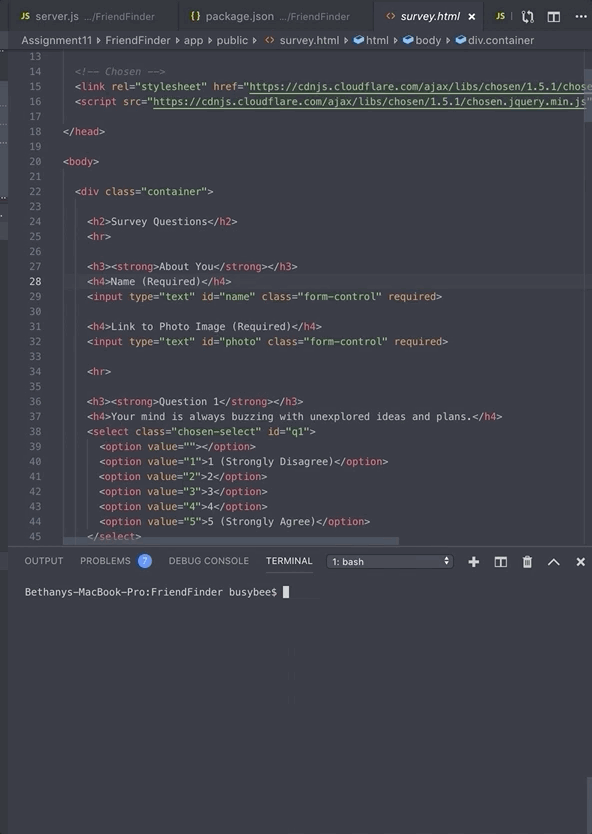
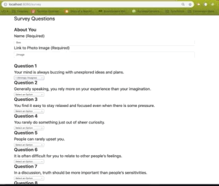
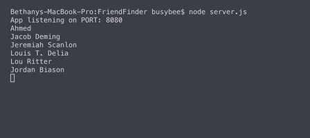

# FriendFinder
A compatibility-based "FriendFinder" application (basically a dating app). This full-stack site will take in results from the users' surveys, then compare their answers with those from other users. The app will then display the name and picture of the user with the best overall match. 


> The application utilizes Express to handle routing. The app will be deployed to Heroku so that other users can fill it out.


### App will be deployed to Heroku >>soon!<< but until then, follow these commands to run the app locally:
```
> git clone [file name]
> npm install
> node server.js
> open web browser to: http://localhost:8080
> fill out the form to find your best friend!
```

### Check it out!






##### Heroku Deployment
https://fast-thicket-86680.herokuapp.com/
> Heroku deployment not yet successful (this ReadMe will be updated when it is functional)
